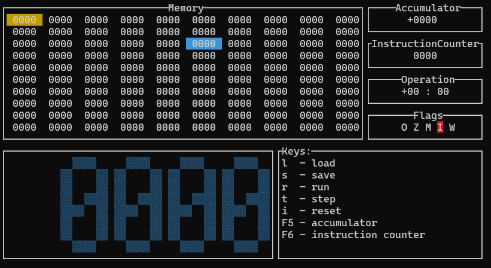

# SimpleComputer [](https://app.travis-ci.com/ElaSparks/SimpleComputer)
> A simple computer emulator.
## Introduction
This application was written as part of a university course "computer architecture".
## Dependencies

<ul>
<li>g++</li>
<li>make</li>
<li>cmake</li>
<li>clang-format</li>
</ul>

## Usage
Clone repository:

```sh
git clone https://github.com/ElaSparks/SimpleComputer
```

Build project:

```sh
make
```

Run the programm:

```sh
make run
```

## Preview

